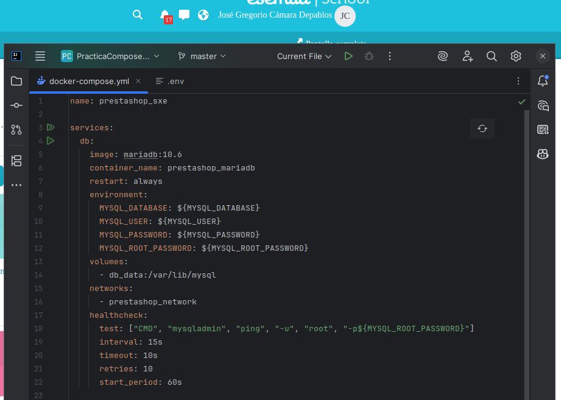
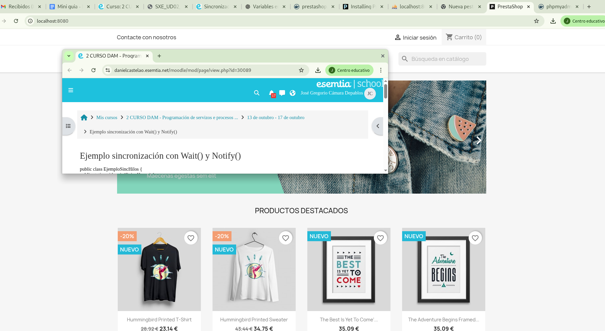

# Instalación de servicio Prestashop con Docker Compose

En este README utilizaremos la herramienta Docker Compose para crear un multicontenedores para poner en marcha un servicio de Prestashop con un solo archivo YML.

<details><summary><h3>ÍNDICE</h3></summary>

* [Descripción General](#Instalación-de-Servicio-Web-con-Docker-Apache)

* [Descarga de la Imagen "httpd" y comprobación de la misma](#Descarga-de-la-Imagen-httpd-y-comprobación-de-la-misma)

* [Creación de contenedor Apache con el nombre "dam_web1"](#Creación-de-contenedor-Apache-con-el-nombre-dam_web1)

* [Comprobación del Servicio](#Comprobación-del-Servicio)

* [Crear "bind mount"](#Crear-bind_mount)

* [Creación de segundo contenedor "dam_web2"](#Creación-de-segundo-contenedor-dam_web2)

* [Modificaciones en el archivo HTML compartido](#Modificaciones-en-el-archivo-HTML-compartido)

* [Contacto](#Contacto)

* [Documentación](#Documentación)

</details>

## Preparación de archivo YML: 

Para crear los distintos contenedores en un único servicio se tiene que crear un archivo docker-compose.yml en la carpeta origen donde se realizará el siguiente comando para hacer funcionar el servicio:
    
```bash
docker compose up -d
```
<br><br>

## Preparación de los contenedores:

<details><summary><h3>Contenedor de la base de datos Mariadb</h3></summary>
  
  Para configurar la base de datos Mariadb hacemos uso de los siguientes atributos: 
  
  <br><br>

  | Atributo        | Valor                | Descripción                                                                                          |
   | ------------------- | ------------------------- | ----------------------------------------------------------------------------------------------------- |
   | name               | prestashop_sxe             | Es un atributo de alto nivel utilizado para darle un nombre al orquestador  |
   | services           |                            | Es un array asociativo en el que se definen dentro los distintos servicios                                       |
   | image               | mariadb:10.6              | Especifica la imagen en la que se basa el contenedor, en este caso es la base de datos mariadb la versión 10.6  |
   | container_name      | prestashop_mariadb        | Especifica un nombre personalizado para el contenedor, en este caso es "prestashop_mariadb", si no se especifica Docker genera uno automáticamanete.   |
   | restart             | always                    | Indica cuando debe reiniciarse el contenedor, sus valores pueden ser: no (no se reinicia), always (se reincia siempre que el contenedor se detenga), on-failure (se reinicia solo si falla), unless-stopped (se reinicia siempre a menos que se detenga manualmente). |
   | environment         |                           | Es el atributo en la que se ván a especificar las distintas variables de entorno para el correcto funcionamiento del contenedor. |
   | MYSQL_DATABASE      | ${MYSQL_DATABASE}         | Aquí se especifica el nombre de la base de datos, en este caso está codificado para que coja el valor de un archivo .env |
   | MYSQL_USER          | ${MYSQL_USER}             | Aquí se especifíca el usuario de la base de datos, en el ejemplo está codificado para buscar el valor en el archivo .env|
   | MYSQL_PASSWORD      | ${MYSQL_PASSWORD}         | Aquí se especifíca la contraseña de la base de datos, en el ejemplo está codificado para buscar el valor en el archivo .env|
   | MYSQL_ROOT_PASSWORD | ${MYSQL_ROOT_PASSWORD}    | Sirve para asignar la contraseña del usuario administrador (root) de la base de datos durante la primera inicialización del contenedor. |
   | volumes             | db_data:/var/lib/mysql    | Permite definir una lista de volúmenes, que pueden ser bind mount o un volumen docker. Para reutilizar un volumen en múltiples servicios, se debe definir fuera del bloque services. |
   | networks            | prestashop_network        | Define las redes que se van a crear y que podrán ser usadas por los servicios.                         |
   | healthcheck         |                           | Un healthcheck define un comando que Docker ejecuta periódicamente dentro del contenedor para comprobar su estado. Si la comprobación falla repetidamente, el contenedor se marca como "unhealthy". |
   | test                | ["CMD", "mysqladmin", "ping", "-u", "root", "-p${MYSQL_ROOT_PASSWORD}"] | test es un atributo que indica la prueba que se realizará en el contenedor, en este caso le dice a Docker que ejecute un comando directo (CMD) a traves de la herramienta de MariaDB (mysqladmin) para verificar si el servidor responde (ping) conectado con el usuario root (-u root) y se le pasa la contraseña del usuario root. |
   | interval            | 15s                       | Cada cuanto tiempo se ejecuta el test, en este caso 15s.                                              |
   | timeout             | 10s                       | Cuanto tiempo se espera a que responda, en este caso 10s.                                             |
   | retries             | 10                        | Cuántas veces debe fallar antes de marcarlo como “unhealthy”. En este caso son 10 veces.              |
   | start_period        | 60s                       | Tiempo que Docker espera antes de empezar a hacer las comprobaciones, para dar tiempo al servicio a arrancar.|
  
</details>


Para saber si la imagen se instaló correctamente en nuestro equipo se utiliza el siguiente comando:
    
```bash
docker images
```

Aquí una captura de pantalla:
 - Como se puede ver en el apartado "TAG" tiene la versión 2.4.

 

<br><br>

## Creación de contenedor Apache con el nombre "dam_web1"
Para crear el contenedor de Alpine sin nombre utilizamos el comando:
Para poder crear el contenedor con nombre "dam_web1"utilizaremos el siguiente comando:

```bash
docker run -d --name dam_web1 -p 8000:80 httpd:2.4
```
Explicación de los parametros:
- (-d)&nbsp;&nbsp;&nbsp;&nbsp;Ejecuta el contenedor en segundo plano, viene de la palabra "detached".
- (--name dam_web1)&nbsp;&nbsp;&nbsp;&nbsp;Asigna el nombre al contenedor.
- (-p 8000:80)&nbsp;&nbsp;&nbsp;&nbsp;Este comando mapea el puerto 8000 de tu máquina local al puerto 80 del contenedor.

<br><br>
Captura de pantalla de como se ve el comando en la terminal:

 
 <br><br>
El contenedor arranca automaticamente.


 ## Comprobación del Servicio

Para comprobar que el servicio está en linea entraremos en nuestro localhost de la maquina local:

```bash
http://localhost:8000
```
<br><br>
Captura de pantalla del navegador con el servicio Apache en línea:


Como se puede ver, se visualiza la página por defecto de Apache.
<br><br>

## Crear "bind mount"

Primero tendremos que crear un directorio en nuestro equipo local en donde queramos alojar nuestro servicio web(en este caso se utilizo la dirección del proyecto Docker):

```bash
mkdir -p apache_servidorWeb
```

- Captura de pantalla:


<br><br>
El siguiente paso es averiguar donde está alojado el directorio de 'htdocs' del apache2 en el contenedor, este se consigue en la siguiente ruta:

```bash
/usr/local/apache2/htdocs
```

<br><br>
El siguiente paso es recrear el contenedor "dam_web1" pero con bind mount.

<br><br>
Primero detendremos el contenedor y posteriormente lo eliminamos con los siguientes comandos:

```bash
docker stop dam_web1
docker rm dam_web1
```
<br><br>
Captura de pantalla:


<br><br>

Ahora para crear el contenedor nuevamente con el bind mount utilizamos el siguiente comando:

```bash
docker run -d --name dam_web1 -p 8000:80 \ -v /home/dam/SXE/PracticaDockerApache/apache_servidorWeb:/usr/local/apache2/htdocs \
```
<br><br>

En la siguiente captura de pantalla podemos ver que se crea denuevo el contenedor con el bind mount:


<br><br>

## Creación de "Hola Mundo" en HTML

Para crear el archivo "index.html" con el Hola Mundo en el directorio montado utilizamos el siguiente comando:

```bash
echo "<h1>Hola Mundo desde Apache con Docker</h1>" > ~/apache_servidorWeb/index.html
```

<br><br>

Captura de pantalla:


<br><br>

Ahora para comprobar que se ve el "Hola Mundo" abrimos en el navegador la dirección del localhost:

```bash
http://localhost:8000
```
<br><br>

Captura de pantalla:


<br><br>

## Creación de segundo contenedor "dam_web2"

Usaremos el mismo comando utilizado anteriormente para realizar el bind mount pero en puerto distinto, este caso "9080":
<br><br>

```bash
docker run -d --name dam_web1 -p 9080:80 \ -v /home/dam/SXE/PracticaDockerApache/apache_servidorWeb:/usr/local/apache2/htdocs \
```

Captura de pantalla:

<br><br>

Ahora se tienen en ejecución dos contenedores que comparten el mismo volumen por lo que si consultamos los siguientes puertos:

- http://localhost:8000
- http://localhost:9080
<br><br>

Veremos la misma página en ambas direcciones.

Captura de pantalla:

<br><br>

## Modificaciones en el archivo HTML compartido

Realizaremos unos pequeños cambios en el archivo HTML creado anteriormente, ya sea realizando un "echo" por terminal o directamente en el archivo por block de notas:

Captura de pantalla:
<br><br>

<br><br>

Seguido a esto vamos a detener e iniciar ambos contenedores para refrescar los cambios realizados con los comandos:

```bash
docker stop dam_web1 dam_web2
docker start dam_web1 dam_web2
```

Captura de pantalla:
<br><br>

<br><br>

Al refrescar ambos en enlaces en el navegador deberían mostrar la nueva versión de la pagina web:

Captura de pantalla:
<br><br>

<br><br>

## Contacto
José Gregorio Cámara Depablos - [@CabbaGG](https://x.com/Geek_Cabagge) - JOS.95camara@gmail.com

Project Link: ([Instalación de Servicio Web con Docker-Apache](https://github.com/CabbaGG2/SXE_PracticaDockerApache))

## Documentación

* [Documentación de Docker](https://docs.docker.com/get-started/)
